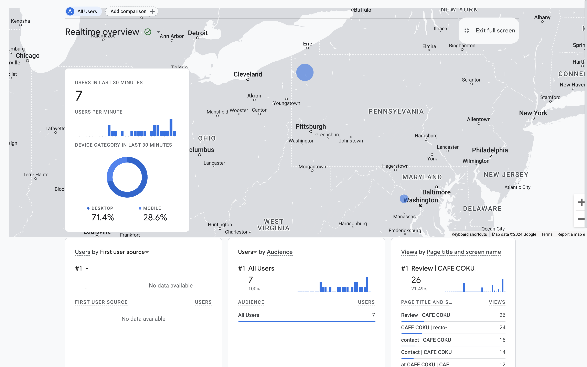
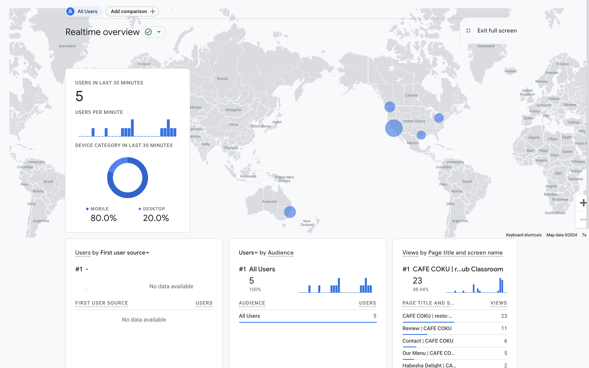

<h1 align="center">
Why we openly partner with Google Analytics: 
</h1>

The geographical data obtained from Google Analytics, indicating that seven website visitors originated from Pittsburgh and Washington, with additional visitors from Seattle, New York, California, and even Australia, presents a valuable opportunity for strategic business enhancement. By discerning the regional distribution of your online audience, you can tailor your marketing efforts with a localized approach. This could involve creating targeted promotions, advertisements, and special events that resonate specifically with customers' preferences in Pittsburgh, Washington, Seattle, New York, California, and Australia. Moreover, the data allows for menu and pricing adjustments based on regional preferences or economic factors, thereby catering to the unique tastes of customers in different locations. Leveraging this information to optimize your online presence, engage with customers through personalized content, and make data-driven operational decisions enables your restaurant to forge stronger connections with diverse audiences and enhance overall business effectiveness.

### At two points of time on the same days, the data are collected as follow:

#### At 4-4:10 PM EST, February 23, 2024:

 

#### At 10-11 PM EST, February 23, 2024:

